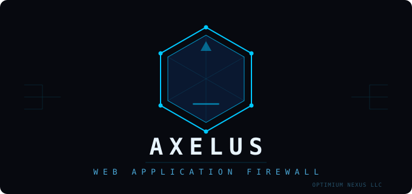

<div align="center">

# AXELUS-WAF

<p align="center"></p>

### Next-Generation AI-Powered Web Application Firewall

[](LICENSE.md)
[](version.json)
[](https://hub.docker.com/u/optimiumnexusllc)
[](https://github.com/optimiumnexusllc/AXELUS-WAF/actions)
[](https://github.com/optimiumnexusllc/AXELUS-WAF/actions/workflows/mirror-images.yml)

**AXELUS-WAF** est un pare-feu applicatif de nouvelle génération, piloté par l'IA, développé par **OPTIMIUM NEXUS LLC**.

[Installation POC](#-installation-poc) · [Installation Production](#-installation-production) · [Architecture](#-architecture) · [Modules](#-modules-premium) · [Conformité](#-conformité) · [Docker Hub](#-docker-hub)

---

</div>

## Prérequis

| Composant | POC (démo) | Production (VM unique) |
|-----------|-----------|----------------------|
| OS | Ubuntu 22.04 / 24.04 LTS | Ubuntu 22.04 / 24.04 LTS |
| RAM | 2 GB minimum | 4 GB recommandé |
| CPU | 2 vCPU | 4 vCPU |
| Disque | 10 GB | 40 GB SSD |
| Docker | 24.0+ | 24.0+ |
| Domaine | Non requis | Optionnel (Let's Encrypt) |

---

## 🚀 Installation POC

Idéal pour tester AXELUS-WAF en 5 à 10 minutes, sans domaine ni TLS.

### 1 — Installer Docker (si absent)

```bash
curl -fsSL https://get.docker.com | sudo bash
sudo systemctl enable docker --now
sudo usermod -aG docker $USER && newgrp docker
```

### 2 — Cloner et installer

```bash
git clone https://github.com/optimiumnexusllc/AXELUS-WAF.git
cd AXELUS-WAF
sudo bash install/setup-poc.sh
```

Le script effectue automatiquement : génération des secrets, création des répertoires, pull des images depuis `optimiumnexusllc/` sur Docker Hub, démarrage du stack (14 services), healthchecks, installation de la CLI `axelus`, activation systemd.

### URLs d'accès POC

| Service | URL |
|---------|-----|
| WAF Dashboard | `http://SERVER_IP:9443` |
| Grafana | `http://SERVER_IP:3000` |
| API Docs | `http://SERVER_IP:9443/docs` |
| Prometheus | `http://127.0.0.1:9090` (loopback) |

### Vérification POC

```bash
axelus status
curl -s http://localhost:9443/api/open/health
# Test blocage SQLi — doit retourner 403
curl -s -o /dev/null -w "%{http_code}" "http://localhost/?id=1+UNION+SELECT+*+FROM+users--"
```

---

## 🏭 Installation Production

Le script de production durcit le système en 12 étapes (~15 minutes) :
TLS, firewall UFW, SSH durci, fail2ban, secrets sécurisés, backups automatisés, monitoring avec alertes.

### Cas 1 — Avec un nom de domaine (Let's Encrypt)

Le domaine doit pointer sur le serveur (enregistrement DNS A) avant de lancer le script.

```bash
git clone https://github.com/optimiumnexusllc/AXELUS-WAF.git
cd AXELUS-WAF

sudo bash install/setup-production.sh \
  --domain waf.monentreprise.com \
  --email  admin@monentreprise.com
```

Avec toutes les options :

```bash
sudo bash install/setup-production.sh \
  --domain        waf.monentreprise.com \
  --email         admin@monentreprise.com \
  --ssh-key       "ssh-ed25519 AAAA... user@laptop" \
  --admin-ip      10.0.0.0/8 \
  --slack-webhook https://hooks.slack.com/services/XXX \
  --smtp-host     smtp.gmail.com \
  --smtp-user     alerts@monentreprise.com \
  --smtp-pass     monmotdepasse \
  --backup-s3     mon-bucket-backups
```

---

### Cas 2 — Sans domaine, avec une IP locale uniquement

Le script détecte automatiquement qu'une IP est fournie et génère un **certificat auto-signé** (RSA-4096, SAN incluant l'IP). Aucun paramètre supplémentaire requis.

```bash
# IP locale (réseau interne, lab, intranet)
sudo bash install/setup-production.sh \
  --domain 192.168.1.100 \
  --email  admin@monentreprise.com

# Avec restriction d'accès admin à votre sous-réseau
sudo bash install/setup-production.sh \
  --domain   192.168.1.100 \
  --email    admin@monentreprise.com \
  --admin-ip 192.168.1.0/24
```

> Le navigateur affichera un avertissement pour le certificat auto-signé.
> Pour le supprimer : importer `/data/axelus-waf/certs/axelus.crt` dans les autorités de confiance de vos postes.

```bash
# Récupérer le certificat pour l'importer
cat /data/axelus-waf/certs/axelus.crt
```

---

### URLs d'accès Production

Tous les accès passent par Nginx sur le port 443. Les ports internes (9443, 3000, 9090) sont **bloqués par le firewall**.

| Service | URL | Accès |
|---------|-----|-------|
| WAF Dashboard | `https://DOMAIN_OU_IP/waf/` | Restreint `--admin-ip` |
| API REST | `https://DOMAIN_OU_IP/api/` | Restreint `--admin-ip` |
| Grafana | `https://DOMAIN_OU_IP/grafana/` | Restreint `--admin-ip` |
| Health check | `https://DOMAIN_OU_IP/health` | Public |

---

### Ce que le script production configure

| Étape | Action |
|-------|--------|
| 1 | Vérification RAM, disque, Docker |
| 2 | nginx, certbot, ufw, fail2ban, auditd, unattended-upgrades |
| 3 | User `axelus`, répertoires `chmod 750` |
| 4 | Secrets 32+ chars, `.env` en `chmod 600` propriétaire `axelus` |
| 5 | **UFW** : deny all, allow 22/80/443 uniquement |
| 6 | **SSH** : no root, max 3 tentatives, bannière légale |
| 7 | **fail2ban** : SSH ban 24h (3 échecs), admin ban 1h (10 erreurs 4xx) |
| 8 | **TLS 1.3** auto-détecté (Let's Encrypt si domaine, auto-signé si IP) + Nginx HSTS |
| 9 | Prometheus rules (7 alertes) + AlertManager (Slack + email) |
| 10 | Stack Docker + attente healthchecks |
| 11 | Backup quotidien 02h, logrotate 30j, auditd, mises à jour sécurité auto |
| 12 | Systemd watchdog 5min, CLI étendue |

---

### 🔄 Différences POC vs Production

| Point | POC | Production |
|-------|-----|-----------|
| TLS | Non (HTTP) | Oui (Let's Encrypt ou auto-signé) |
| Port admin | 9443 exposé | Fermé — accès via `/waf/` HTTPS |
| Firewall | Non | UFW strict (22/80/443 uniquement) |
| SSH | Par défaut | Durci, no root, max 3 tentatives |
| fail2ban | Non | Oui (SSH + admin) |
| Secrets | `.env` chmod 640 | `.env` chmod **600** owner `axelus` |
| Backups | Manuels | Quotidiens automatiques (02h) |
| Alertes | Non | Prometheus + Slack/email |
| Mises à jour | Manuelles | Sécurité automatique |

---

### CLI de gestion

```bash
axelus status          # état des conteneurs
axelus logs mgt        # logs API en temps réel
axelus restart         # redémarrer tout
axelus update          # pull nouvelles images + restart
axelus backup          # backup immédiat
axelus restore <file>  # restauration depuis backup .sql.gz
axelus health          # santé API via HTTPS
axelus ufw             # état du firewall
axelus fail2ban        # IPs bannies
axelus cert            # expiration du certificat TLS
axelus audit           # log d'audit récent
axelus compliance      # rapport PCI-DSS instantané
```

---

## 📦 Docker Hub

Images publiées sous `optimiumnexusllc`, mises à jour mensuellement via GitHub Actions.

```bash
docker pull optimiumnexusllc/axelus-postgres:15.2
docker pull optimiumnexusllc/axelus-mgt:latest
docker pull optimiumnexusllc/axelus-tengine:latest
docker pull optimiumnexusllc/axelus-detector:latest
docker pull optimiumnexusllc/axelus-fvm:latest
docker pull optimiumnexusllc/axelus-luigi:latest
docker pull optimiumnexusllc/axelus-chaos:latest
```

→ [hub.docker.com/u/optimiumnexusllc](https://hub.docker.com/u/optimiumnexusllc)

---

## 🏗 Architecture

```
Internet (HTTPS :443)
        │
   ┌────▼────────────────────────────────┐
   │  Nginx — TLS 1.3 + HSTS             │
   │  /waf/     → axelus-mgt:9443 (admin)│
   │  /api/     → axelus-mgt:9443 (admin)│
   │  /grafana/ → grafana:3000   (admin) │
   │  /health   → axelus-mgt     (public)│
   └────┬────────────────────────────────┘
        │
   ┌────▼──────────┐   ┌───────────────────┐
   │  axelus-waf   │──▶│  axelus-mgt :9443 │
   │  Tengine :443 │   │  Management API   │
   └───────────────┘   └─────────┬─────────┘
                                 │
              ┌──────────────────┼──────────────────┐
              │                  │                  │
        ┌─────▼──┐  ┌────────┐  ┌▼───────────┐  ┌──▼───────┐
        │postgres│  │ redis  │  │  detector  │  │prometheus│
        └────────┘  └────────┘  │  (ML/AI)   │  │ grafana  │
                                └────────────┘  └──────────┘
```

---

## 🔒 Modules Premium

| Module | Description |
|--------|-------------|
| ML Inference Pipeline | ONNX, 64 features, 15 classes, A/B testing |
| WebSocket + gRPC DPI | Inspection L7 RFC 6455, Protobuf wire |
| BGP Null-Routing | RFC 7999 BLACKHOLE, auto-expiry, FlowSpec |
| UBA/UEBA | 8 signaux comportementaux, credential stuffing |
| Kafka Streaming | 10 topics, 100k+ req/s, multi-tenant |
| GeoIP Blocking | MaxMind GeoIP2, CIDR, ASN |
| Honeypot | 25 trap paths, auto-blacklist |
| DDoS Mitigation | EWMA velocity, intégration BGP |
| Forensics + PCAP | Ring buffer, evidence ZIP SHA-256 |
| mTLS | SPIFFE URIs, ECDSA-P256, rotation 24h |

---

## 📋 Conformité — 120 contrôles, 10 standards

| Standard | Contrôles |
|----------|-----------|
| PCI DSS v4.0 | 20 |
| ISO/IEC 27001:2022 | 15 |
| SOC 2 Type II | 11 |
| NIST CSF 2.0 | 14 |
| GDPR | 6 |
| HIPAA | 8 |
| CIS Controls v8 | 16 |
| NIS2 Directive | 10 |
| OWASP Top 10 | 10 |
| FedRAMP High | 10 |

```bash
axelus compliance   # rapport PCI-DSS instantané
```

---

## 🔧 Dépannage

**Conteneurs qui ne démarrent pas**
```bash
docker compose -f docker-compose.poc.yml logs --tail 50
df -h   # espace disque suffisant ?
```

**Certificat auto-signé — avertissement navigateur**
```bash
# Importer dans vos postes (Windows)
cat /data/axelus-waf/certs/axelus.crt   # copier ce contenu
# Ouvrir "Gérer les certificats" → Autorités racines → Importer

# curl sans vérification
curl -k https://192.168.1.100/health
```

**fail2ban a banni votre IP**
```bash
sudo fail2ban-client set sshd unbanip VOTRE_IP
```

**Renouvellement Let's Encrypt échoue**
```bash
sudo certbot renew --dry-run
sudo systemctl reload nginx
```

---

## 📁 Structure

```
AXELUS-WAF/
├── install/
│   ├── setup-poc.sh           # Installation POC (5-10 min)
│   ├── setup-production.sh    # Installation production (15 min)
│   └── mirror-images.sh       # Mirroring Docker Hub manuel
├── docker-compose.poc.yml     # Stack Docker (images optimiumnexusllc)
├── images/axelus-*/Dockerfile # Dockerfiles des images
├── .github/workflows/
│   ├── mirror-images.yml      # Mirroring mensuel automatique
│   └── build-images.yml       # Build images améliorées
├── premium/                   # Modules premium (Go)
├── helm/axelus/               # Helm chart Kubernetes
├── sdk/python/                # SDK Python
├── sdk/nodejs/                # SDK Node.js
└── monitoring/                # Config Prometheus/Grafana
```

---

## 📞 Support

| Canal | Contact |
|-------|---------|
| Documentation | https://www.optimiumnexus.com/docs |
| Email | contact@optimiumnexus.com |
| GitHub | https://github.com/optimiumnexusllc/AXELUS-WAF/issues |
| Docker Hub | https://hub.docker.com/u/optimiumnexusllc |

---

<div align="center">

**AXELUS-WAF** — Développé et maintenu par **OPTIMIUM NEXUS LLC**

[www.optimiumnexus.com](https://www.optimiumnexus.com) · [contact@optimiumnexus.com](mailto:contact@optimiumnexus.com)

</div>
